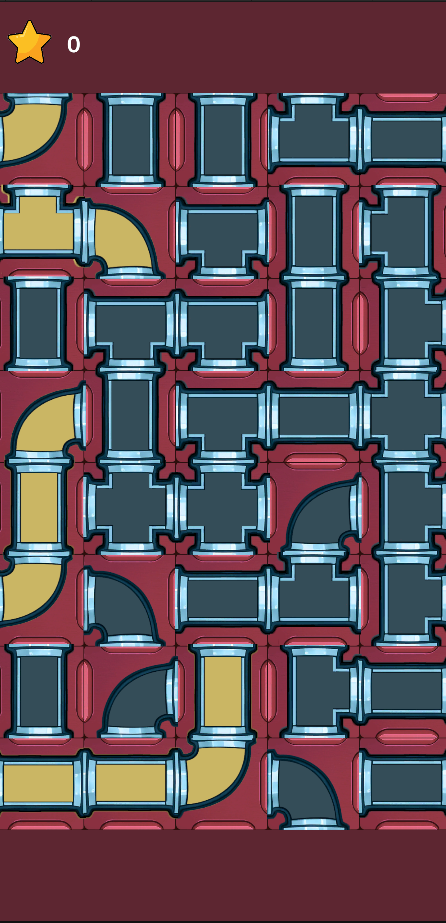

# PipePuzzles

Казуальная головоломка на Unity: вращай трубы на сетке и собирай непрерывный поток.

## Цель игры

**Построить максимально длинный путь.**

Нажимайте на сегменты труб, чтобы поворачивать их. Соединяйте прямые, уголки, тройники и крестовины в одну непрерывную цепочку — чем длиннее заполненный путь, тем выше результат.

## Как играть

1. Тапните по трубе, чтобы повернуть её на 90°.
2. Следите за жёлтым (активным) потоком — он показывает текущий путь.
3. Серые трубы ещё не входят в цепочку: поверните их так, чтобы продлить поток.
4. Чем длиннее непрерывный путь, тем больше очков.

## Типы труб

| Тип | Описание |
|-----|----------|
| **I** | Прямая — соединяет противоположные стороны |
| **L** | Уголок — поворот на 90° |
| **T** | Тройник — три направления |
| **X** | Крест — все четыре стороны |

## Стек

- Unity 6
- C#
- Zenject, UniTask, DOTween, LeanPool

## Лицензия

См. [LICENSE](LICENSE).
